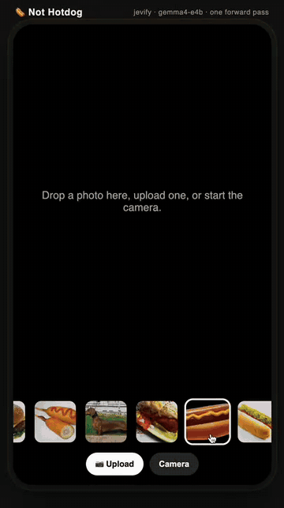

# Not Hotdog

The SeeFood app from Silicon Valley, on jevify. One image, one question, one forward pass.

<p align="center"></p>

([mp4](media/not-hotdog.mp4), 20 s)

```bash
uv run --extra transformers python examples/hotdog/app.py --model kushalpatil/jevify-gemma4-e4b
open http://127.0.0.1:8000
```

Upload a photo, drop one in, click a sample, or start the camera and hit Live (a frame every
400 ms). You get the verdict, `P(hot dog)`, and what it actually is, from one call:

```python
jev.system_one({"image": img}, {
    "hotdog": Noul("Is this a hot dog?"),
    "food":   Choice("What is this?", {f: None for f in FOODS}),
})
```

On the ten photos in `samples/` (jevify-gemma4-e4b, one B200, 130 to 450 ms per image):

| photo | verdict | P(hot dog) | actually |
|---|---|---|---|
| hotdog_mustard | HOTDOG | 0.993 | hot dog 1.00 |
| hotdog_chicago | HOTDOG | 0.967 | hot dog 0.83 |
| hotdog_stand | HOTDOG | 0.893 | hot dog 0.91 |
| burger | NOT HOTDOG | 0.001 | hamburger 1.00 |
| pizza | NOT HOTDOG | 0.000 | pizza 1.00 |
| banana | NOT HOTDOG | 0.000 | fruit 1.00 |
| dachshund | NOT HOTDOG | 0.004 | not food 0.93 |
| corn_dog | NOT HOTDOG | 0.269 | dessert 0.83, hot dog 0.14 |
| sausage_no_bun | HOTDOG | 0.562 | hot dog 0.97 |
| sub_sandwich | HOTDOG | 0.500 | sandwich 0.92 |

The clear cases sit at 0.00 or 0.99. The two arguable ones, a bratwurst with no bun and a sub, come
out at 0.56 and 0.50, which is about what a room of people would say. A raw Gemma 4 gives 0.99 on
everything it calls a hot dog.

Runs on a Mac with MPS too, at a few seconds per image. Sample photos are from Wikimedia Commons.
